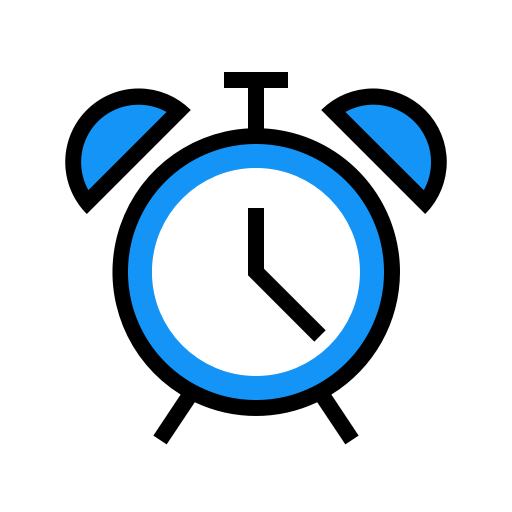
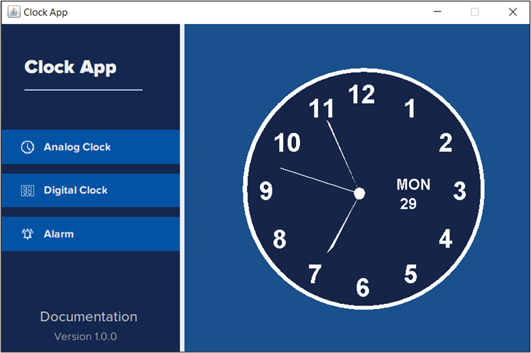
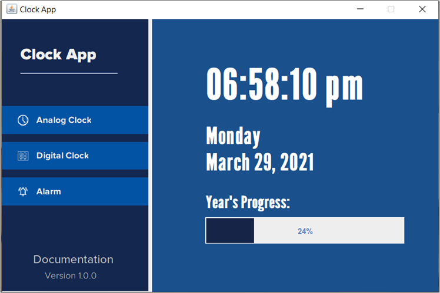
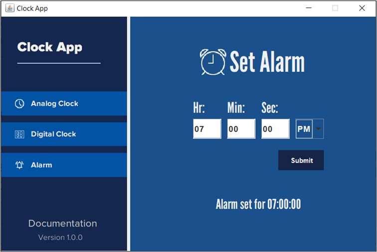
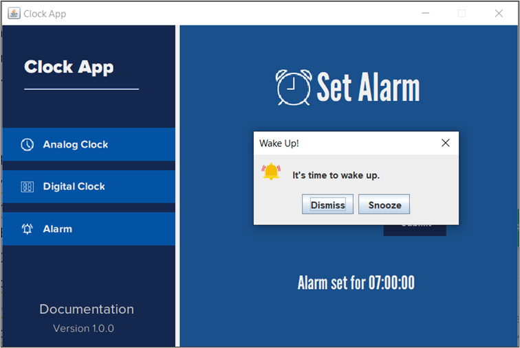

<!-- Improved compatibility of back to top link: See: https://github.com/othneildrew/Best-README-Template/pull/73 -->

<!--
*** Thanks for checking out the Best-README-Template. If you have a suggestion
*** that would make this better, please fork the repo and create a pull request
*** or simply open an issue with the tag "enhancement".
*** Don't forget to give the project a star!
*** Thanks again! Now go create something AMAZING! :D
-->

<!-- PROJECT SHIELDS -->
<!--
*** I'm using markdown "reference style" links for readability.
*** Reference links are enclosed in brackets [ ] instead of parentheses ( ).
*** See the bottom of this document for the declaration of the reference variables
*** for contributors-url, forks-url, etc. This is an optional, concise syntax you may use.
*** https://www.markdownguide.org/basic-syntax/#reference-style-links
-->
[![Contributors][contributors-shield]][contributors-url]
[![Forks][forks-shield]][forks-url]
[![Stargazers][stars-shield]][stars-url]
[![Issues][issues-shield]][issues-url]
[![MIT License][license-shield]][license-url]
[![LinkedIn][linkedin-shield]][linkedin-url]

<!-- PROJECT LOGO -->
 

  

<h3 align="center">Java Clock App</h3>

  

Our Clock App GitHub repository showcases a Java Swing-based timekeeping solution that combines analog and digital clocks in one elegant interface. The app allows users to view the time in both formats and set alarms for important events. With a user-friendly design and approximately 1100 lines of meticulously crafted Java code, the Clock App offers a seamless and intuitive experience for all users.
     
    <a href="https://github.com/knowgaurav/java-clock-app">View Demo</a>
    ·
    <a href="https://github.com/knowgaurav/java-clock-app/issues">Report Bug</a>
    ·
    <a href="https://github.com/knowgaurav/java-clock-app/issues">Request Feature</a>
  

<!-- TABLE OF CONTENTS -->

  
Table of Contents

  <ol>
    <li>
      <a href="#about-the-project">About The Project</a>
      <ul>
        <li><a href="#built-with">Built With</a></li>
      </ul>
    </li>
    <li><a href="#usage">About</a></li>
    <li><a href="#license">License</a></li>
    <li><a href="#contact">Contact</a></li>
    <li><a href="#acknowledgments">Acknowledgments</a></li>
  </ol>

<!-- ABOUT THE PROJECT -->
## About The Project

  

  

  

  

(<a href="#readme-top">back to top</a>)

### Built With

* 

(<a href="#readme-top">back to top</a>)

<!-- GETTING STARTED -->
## Details

**Clock App: A Java Swing-based Timekeeping Solution**

Welcome to our GitHub repository for the Clock App project! In this repository, we present a simple, elegant, and feature-rich clock application that combines both analog and digital timekeeping in one convenient package. Developed using the Java Swing Framework, our clock app offers an intuitive graphical user interface (GUI) for a seamless user experience.

**Key Features:**

1. **Analog and Digital Clock:** Our clock app provides users with the option to view the time in both analog and digital formats. The analog clock panel offers a traditional clock face with hour and minute hands, while the digital clock panel displays the time in a clear and easily readable format.

2. **Alarm Functionality:** Users can also set alarms using the alarm panel. The app allows users to specify the time for the alarm to go off, providing a helpful reminder for important events or activities.

3. **Java Swing GUI Components:** We have utilized a variety of Java Swing components, such as JLabel, JButton, JTextArea, and JPanel, to create a visually appealing and interactive interface for the app.

**Project Structure:**

The project consists of four classes:

1. **AnalogClockPanel:** This class handles the rendering and updates for the analog clock panel.

2. **DigitalClockPanel:** This class manages the display of the digital clock panel.

3. **AlarmPanel:** Responsible for handling alarm settings and triggering alarm notifications.

4. **Main:** This class contains the main method to execute the application and display the JFrame that houses the three clock panels.

**Line Count:**

Our codebase contains approximately 1100 lines of pure Java code, thoughtfully written and conceptualized by hand to ensure the app's efficiency and functionality.

**Benefits:**

- **All-in-One Solution:** Our clock app combines the traditional charm of an analog clock with the modern convenience of a digital display, all while offering alarm functionality in one comprehensive package.

- **User-Friendly Interface:** The Java Swing GUI components and thoughtful design make the app easy to use and visually appealing for users of all ages.

- **Open Source:** As an open-source project, our repository encourages collaboration, contributions, and improvements from the community, ensuring ongoing enhancements and refinements to the app.

(<a href="#readme-top">back to top</a>)

<!-- LICENSE -->
## License

Distributed under the MIT License. See `LICENSE.txt` for more information.

(<a href="#readme-top">back to top</a>)

<!-- CONTACT -->
## Contact

Gaurav Singh - [@knowgaurav01](https://twitter.com/knowgaurav01) - hello@sgaurav.me

Project Link: [https://github.com/knowgaurav/java-clock-app](https://github.com/knowgaurav/java-clock-app)

(<a href="#readme-top">back to top</a>)

<!-- MARKDOWN LINKS & IMAGES -->
<!-- https://www.markdownguide.org/basic-syntax/#reference-style-links -->
[contributors-shield]: https://img.shields.io/github/contributors/knowgaurav/java-clock-app.svg?style=for-the-badge
[contributors-url]: https://github.com/knowgaurav/java-clock-app/graphs/contributors
[forks-shield]: https://img.shields.io/github/forks/knowgaurav/java-clock-app.svg?style=for-the-badge
[forks-url]: https://github.com/knowgaurav/java-clock-app/network/members
[stars-shield]: https://img.shields.io/github/stars/knowgaurav/java-clock-app.svg?style=for-the-badge
[stars-url]: https://github.com/knowgaurav/java-clock-app/stargazers
[issues-shield]: https://img.shields.io/github/issues/knowgaurav/java-clock-app.svg?style=for-the-badge
[issues-url]: https://github.com/knowgaurav/java-clock-app/issues
[license-shield]: https://img.shields.io/github/license/knowgaurav/java-clock-app.svg?style=for-the-badge
[license-url]: https://github.com/knowgaurav/java-clock-app/blob/master/LICENSE.txt
[linkedin-shield]: https://img.shields.io/badge/-LinkedIn-black.svg?style=for-the-badge&logo=linkedin&colorB=555
[linkedin-url]: https://in.linkedin.com/in/knowgaurav
[product-screenshot]: images/screenshot.png
[Next.js]: https://img.shields.io/badge/next.js-000000?style=for-the-badge&logo=nextdotjs&logoColor=white
[Next-url]: https://nextjs.org/
[React.js]: https://img.shields.io/badge/React-20232A?style=for-the-badge&logo=react&logoColor=61DAFB
[React-url]: https://reactjs.org/
[Vue.js]: https://img.shields.io/badge/Vue.js-35495E?style=for-the-badge&logo=vuedotjs&logoColor=4FC08D
[Vue-url]: https://vuejs.org/
[Angular.io]: https://img.shields.io/badge/Angular-DD0031?style=for-the-badge&logo=angular&logoColor=white
[Angular-url]: https://angular.io/
[Svelte.dev]: https://img.shields.io/badge/Svelte-4A4A55?style=for-the-badge&logo=svelte&logoColor=FF3E00
[Svelte-url]: https://svelte.dev/
[Laravel.com]: https://img.shields.io/badge/Laravel-FF2D20?style=for-the-badge&logo=laravel&logoColor=white
[Laravel-url]: https://laravel.com
[Bootstrap.com]: https://img.shields.io/badge/Bootstrap-563D7C?style=for-the-badge&logo=bootstrap&logoColor=white
[Bootstrap-url]: https://getbootstrap.com
[JQuery.com]: https://img.shields.io/badge/jQuery-0769AD?style=for-the-badge&logo=jquery&logoColor=white
[JQuery-url]: https://jquery.com 
[C++]: https://img.shields.io/badge/c++-%2300599C.svg?style=for-the-badge&logo=c%2B%2B&logoColor=white
[C++-url]: https://isocpp.org/
[Codeforces]: https://img.shields.io/badge/Codeforces-445f9d?style=for-the-badge&logo=Codeforces&logoColor=white
[Codeforces-url]: https://codeforces.com/
[LeetCode]: https://img.shields.io/badge/LeetCode-000000?style=for-the-badge&logo=LeetCode&logoColor=#d16c06
[LeetCode-url]: https://leetcode.com